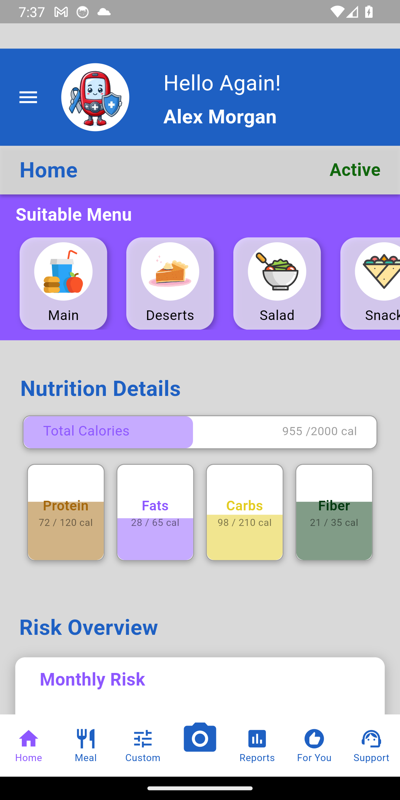
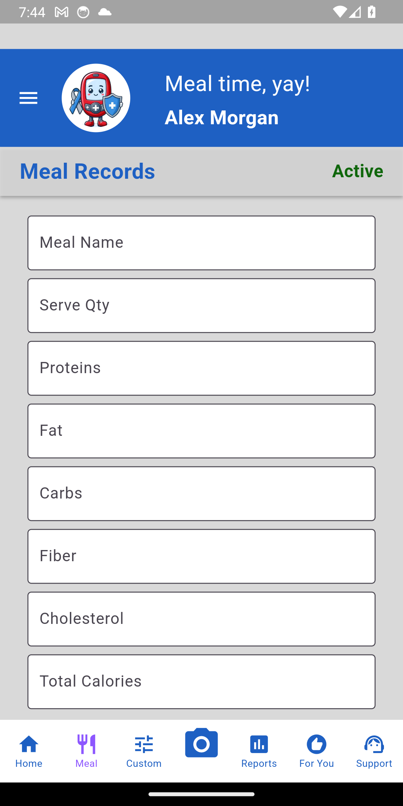
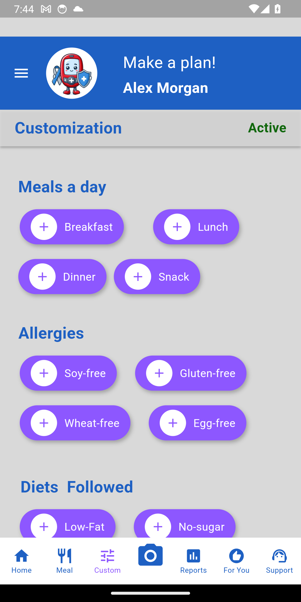
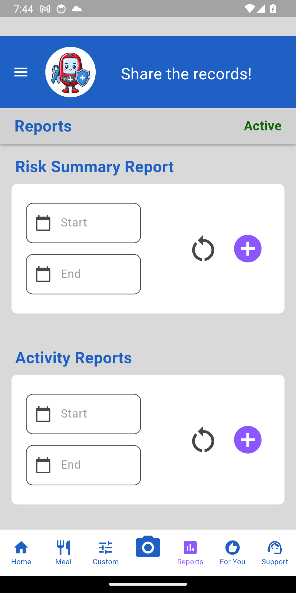
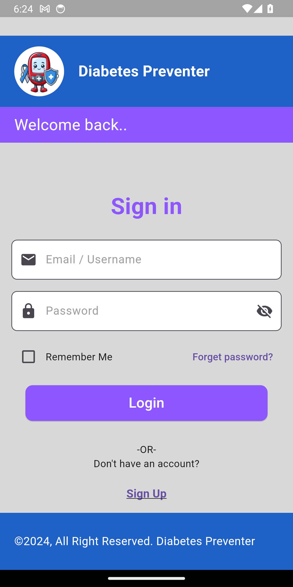
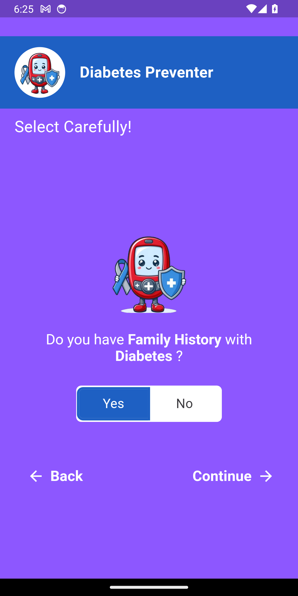
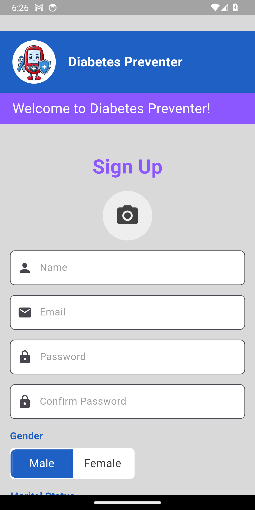
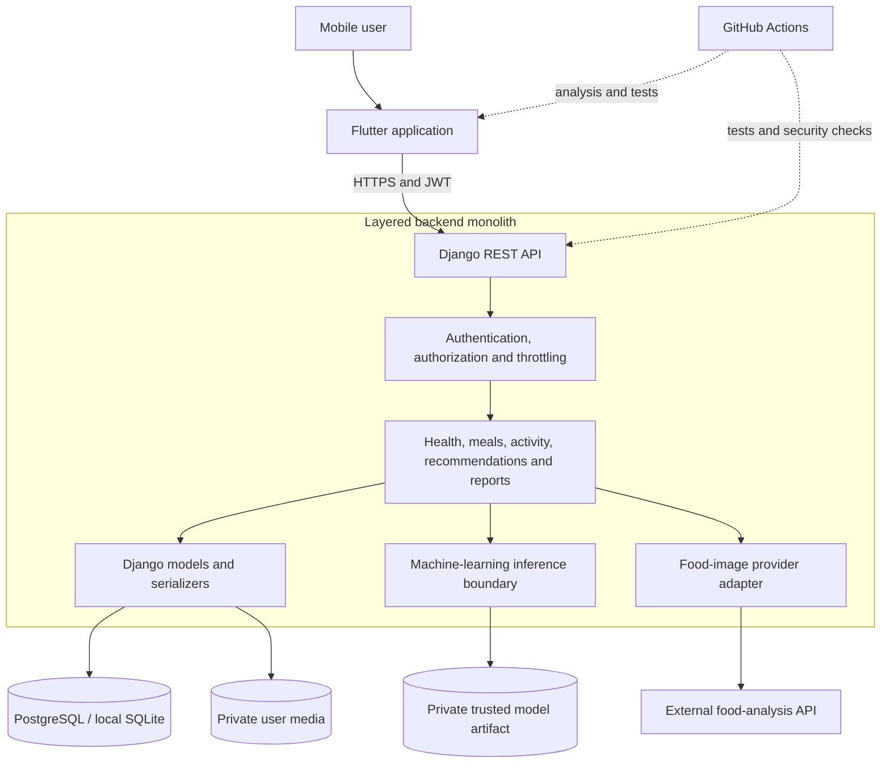

# Diabetes Preventer

> A mobile health companion for monitoring lifestyle patterns, understanding
> diabetes risk factors, and supporting healthier everyday decisions.


## Project recognition

Diabetes Preventer was created as my Final Year Project (FYP) and was selected
to represent my academic programme. The project demonstrates the complete
development of a data-driven mobile product: problem analysis, user-centred
design, full-stack implementation, machine-learning integration, security
hardening, testing, and deployment preparation.

This public repository preserves the engineering work while keeping assessment
documents, personal data, credentials, datasets, and trained model artifacts
outside Git.

## Product screens

The following screenshots were captured directly from the Flutter application
running on an Android emulator. Authenticated views use a fictional local demo
profile and contain no personal or production data.

### Core product experience

<table>
  <tr>
    <th>Health dashboard</th>
    <th>Meal tracking</th>
    <th>Dietary customisation</th>
    <th>Reports hub</th>
  </tr>
  <tr>
    <td></td>
    <td></td>
    <td></td>
    <td></td>
  </tr>
</table>

### Account and risk onboarding

<table>
  <tr>
    <th>Secure sign-in</th>
    <th>Risk-factor onboarding</th>
    <th>Account registration</th>
  </tr>
  <tr>
    <td></td>
    <td></td>
    <td></td>
  </tr>
</table>

## Why this project matters

Diabetes prevention depends on understanding patterns across health
measurements, nutrition, activity, stress, and family history. These inputs are
often recorded separately or not recorded at all. Diabetes Preventer brings
them together in one mobile experience and turns the collected information into
clear reports and experimental risk insights.

The application is designed to encourage awareness and informed conversations
with qualified healthcare professionals. It does not diagnose diabetes and is
not a medical device.

## Key capabilities

- **Health monitoring** — records relevant measurements and personal risk
  factors over time.
- **Meal and nutrition tracking** — captures meals and summarises daily
  nutritional intake.
- **Physical activity and stress records** — connects lifestyle information
  with the user's broader health history.
- **Diabetes-risk estimation** — integrates an experimental Random Forest model
  trained with scikit-learn.
- **Visual reports** — presents activity, health, nutrition, and monthly risk
  trends in a format users can understand.
- **Personalised recommendations** — uses health information and dietary
  preferences to support more relevant suggestions.
- **Food-image analysis** — sends validated images through the authenticated
  backend so third-party service credentials never enter the mobile app.
- **Secure account lifecycle** — supports registration, JWT authentication,
  refresh and logout, profile management, and protected password reset.

## Engineering highlights

### Privacy and security by design

- Secrets and deployment values are supplied through environment variables.
- Private files live under the ignored `.private/` directory.
- API endpoints require authentication by default and enforce record ownership.
- Short-lived access tokens, refresh tokens, throttling, and token revocation
  reduce account abuse risk.
- Uploaded images are size-limited, type-checked, decoded, and renamed safely.
- CI performs backend tests, deploy checks, static analysis, dependency audits,
  and Flutter validation.

### Applied machine learning

The backend supports a Random Forest risk-prediction workflow using pandas,
scikit-learn, and joblib. The trained model is deliberately excluded from the
public repository: serialized Python models must come from a trusted source and
should be versioned, evaluated, and deployed independently from application
code.

### Full-stack product delivery

The Flutter client, Django REST API, relational data model, reporting features,
ML integration, secure configuration, and deployment controls form a complete
end-to-end product foundation rather than a standalone prediction notebook.

## Architecture



The project uses a layered monolithic backend: presentation is handled by API
views and serializers, application behaviour is grouped into services and
utilities, and persistence is handled through Django models. This keeps the
deployment simple while maintaining clear responsibility boundaries.

## Technology stack

| Area                 | Technology                                      |
| -------------------- | ----------------------------------------------- |
| Mobile application   | Flutter, Dart, Provider                         |
| Backend API          | Python, Django, Django REST Framework           |
| Authentication       | JSON Web Tokens (JWT)                           |
| Machine learning     | scikit-learn, pandas, joblib                    |
| Data storage         | PostgreSQL or SQLite                            |
| Reports and charts   | Flutter charting and PDF tooling                |
| Quality and security | pytest, Ruff, Bandit, pip-audit, GitHub Actions |

## API endpoint reference

The API is served from the backend root. Public routes are intentionally limited
to account creation, authentication, token renewal, and password recovery. Every
other API route requires a valid bearer access token; user-specific routes also
verify that the authenticated user owns the requested record.

| Area              | Method | Endpoint                             | Access                    | Purpose                                          |
| ----------------- | ------ | ------------------------------------ | ------------------------- | ------------------------------------------------ |
| Account           | `POST` | `/create_user/`                      | Public, throttled         | Register a user and optional profile image       |
| Account           | `POST` | `/login/`                            | Public, throttled         | Authenticate and issue JWT tokens                |
| Account           | `POST` | `/token/refresh/`                    | Public with refresh token | Renew an access token                            |
| Account           | `POST` | `/logout/`                           | Authenticated             | Revoke the user's existing token version         |
| Account           | `PUT`  | `/update_user/`                      | Owner only                | Update profile details or credentials            |
| Password recovery | `POST` | `/request_otp/`                      | Public, throttled         | Request a one-time password-reset code           |
| Password recovery | `POST` | `/verify_otp/`                       | Public, throttled         | Verify the code and set a validated password     |
| Health            | `POST` | `/health-record/`                    | Owner only                | Create or update today's health record           |
| Health            | `GET`  | `/health-record/last/{user_id}/`     | Owner only                | Return the latest health record and risk metrics |
| Health            | `POST` | `/physical_record/`                  | Owner only                | Create or update today's activity record         |
| Meals             | `POST` | `/create_meal/`                      | Owner only                | Record a meal and its nutritional values         |
| Meals             | `GET`  | `/total_daily_nutrition/{user_id}/`  | Owner only                | Aggregate today's nutritional intake             |
| Preferences       | `POST` | `/update-customization/`             | Owner only                | Save dietary preferences and limits              |
| Preferences       | `GET`  | `/get-user-customization/{user_id}/` | Owner only                | Return the latest dietary customisation          |
| Recommendations   | `GET`  | `/user_recommendations/{user_id}/`   | Owner only                | Return recommendations filtered for the user     |
| Image analysis    | `POST` | `/analyze-food-image/`               | Authenticated, throttled  | Validate and proxy a food image for analysis     |
| Risk model        | `POST` | `/test_model/`                       | Authenticated             | Run experimental model inference                 |
| Risk model        | `GET`  | `/monthly_risk/{user_id}/`           | Owner only                | Calculate six-month risk history                 |
| Reports           | `GET`  | `/activity_report/{user_id}/`        | Owner only                | Generate an activity report for a date range     |
| Reports           | `GET`  | `/risk_summary_report/{user_id}/`    | Owner only                | Generate a diabetes-risk summary                 |
| Reports           | `GET`  | `/health_summary_report/{user_id}/`  | Owner only                | Generate a health summary                        |

The Django administration interface is available separately at `/admin/` and
requires authorised staff credentials. Endpoint behaviour is defined in
[`backend/api/urls.py`](backend/api/urls.py); this table should be updated when
that routing file changes.

## Repository structure

```text
.
|-- backend/                 Django REST API and ML integration
|   |-- api/                 Domain models, endpoints, security, and tests
|   `-- backend/             Project configuration and URL routing
|-- frontend/                Flutter mobile application
|   |-- lib/Pages/           Product screens
|   |-- lib/services/        Authenticated API clients and integrations
|   |-- lib/models/          Mobile data models
|   `-- lib/widgets/         Reusable interface components
|-- docs/                    History, provenance, and release guidance
|-- scripts/                 Public-tree safety checks
`-- .private/                Local-only secrets and artifacts (ignored by Git)
```

## Getting started

### Prerequisites

- Python compatible with the versions in `backend/requirements.txt`
- Flutter SDK with Dart 3.2 or newer
- PostgreSQL for deployment, or SQLite for local development

### 1. Configure and run the backend

Create `.private/.env` using `backend/.env.example` as the template. Supply a
unique `DJANGO_SECRET_KEY` and configure the database and allowed origins for
your environment.

```powershell
cd backend
python -m venv .venv
.\.venv\Scripts\Activate.ps1
pip install -r requirements.txt
python manage.py migrate
python manage.py runserver
```

Model-dependent endpoints remain unavailable until a trusted model is placed at
the configured private model path. Never load an untrusted pickle or joblib
file.

### 2. Run the Flutter application

```powershell
cd frontend
flutter pub get
flutter run --dart-define=DIABETES_API_BASE_URL=http://10.0.2.2:8000
```

`10.0.2.2` connects the Android emulator to a backend running on the host
computer. Use the host machine's local network address when testing on a
physical device. Do not pass secrets through `--dart-define`; compiled mobile
applications can be inspected.

## Quality checks

Before opening a pull request, run the relevant checks:

```powershell
cd backend
python manage.py check --deploy
pytest
ruff check .
bandit -c pyproject.toml -r .
pip-audit -r requirements.txt

cd ..\frontend
flutter analyze --no-fatal-infos --no-fatal-warnings
flutter test
```

The repository also includes `scripts/check_public_tree.ps1`, which detects
private paths, sensitive file types, oversized artifacts, and common secret
patterns before publication.

## Development workflow

```text
feature/{name} -> dev -> master -> release
```

Changes should be developed on a focused feature branch, reviewed and
integrated through `dev`, stabilised on `master`, and promoted to a release only
after testing and security checks pass. See [CONTRIBUTING.md](CONTRIBUTING.md)
for the contribution process.

## Public-repository boundaries

This repository intentionally excludes:

- credentials and environment-specific configuration;
- databases, user uploads, and personal information;
- private FYP reports, assessment forms, and supporting documents;
- datasets and trained machine-learning artifacts;
- tunnel credentials and local development state.

Review [the private-storage guide](docs/PRIVATE_STORAGE.md), [asset provenance](docs/ASSET_PROVENANCE.md),
and [the public-release checklist](docs/PUBLIC_RELEASE_CHECKLIST.md) before
publishing or deploying a fork.

## Project history

The application evolved through iterative frontend, backend, reporting,
machine-learning, deployment, and security phases. A concise engineering record
is available in [DEVELOPMENT_HISTORY.md](docs/DEVELOPMENT_HISTORY.md).

## Responsible use

The predictions and recommendations produced by this project are experimental
and educational. They must not be used as a diagnosis, treatment decision, or
substitute for advice from a licensed healthcare professional. Any production
use requires clinical validation, regulatory review, bias evaluation, model
monitoring, and an appropriate privacy programme.

Security concerns should be reported according to [SECURITY.md](SECURITY.md).

## Author

**Albukaai Mohamad (Matt1tech)** — Full-stack, AI Engineer and project creator

## Licensing and rights

The software source code is available under the [MIT License](LICENSE).
Original FYP materials and long-form documentation are not granted under the
MIT licence; their rights and exclusions are explained in
[LICENSE_SCOPE.md](LICENSE_SCOPE.md). Third-party assets and dependencies remain
subject to their respective licences.
